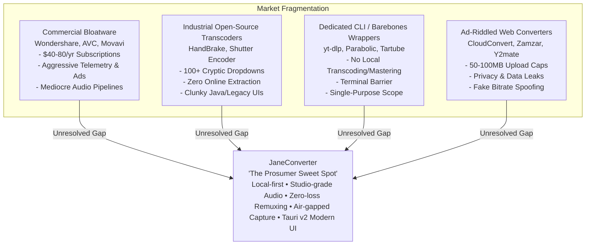

# JaneConverter: Market Analysis & Competitive Audit

**Version Tracked:** JaneConverter v2.2.3
**Publisher:** project//aspyr
**Audit Date:** September 2026

---

## 1. Executive Summary & Market Positioning

### 1.1 The Market Problem
The media ingestion and transcoding software landscape in 2026 is fundamentally fractured into four unsatisfying extremes:

### 1.2 JaneConverter's Strategic Identity
JaneConverter sits at the intersection of **prosumer audio/video production** and **frictionless consumer utility**. It fuses:
1. **Studio-Grade Mastering Fidelity**: 64-bit float SoX resampling (`soxr`), EBU R128 loudness normalization (`-14 LUFS`), and true 24/32-bit linear PCM export.
2. **Instant Zero-Loss Remuxing**: Automated container re-wrapping (`-c copy`) without generational video/audio degradation.
3. **Air-Gapped Ingestion**: A companion browser bridge that captures authenticated active media streams locally without ever accessing, logging, or transmitting session cookies, tokens, or passwords.
4. **Modern Native Architecture**: Tauri v2 + Rust bridge + React 19 + Python 3.12 backend, running under 80MB RAM with zero telemetry and zero paywalls.

---

## 2. Competitive Landscape & Benchmarking Matrix

| Dimension / Feature | JaneConverter (v2.2.3) | HandBrake | Shutter Encoder | Parabolic (Tube Converter) | 4K Video Downloader+ | Wondershare UniConverter | LosslessCut |
| :--- | :--- | :--- | :--- | :--- | :--- | :--- | :--- |
| **Primary Focus** | Universal Downloader + Studio Transcoder | Pure Video Transcoding | Broadcast Video / Post-Production | yt-dlp GUI Download Client | Commercial Web Downloader | Commercial All-in-One Utility | Lossless Video/Audio Slicing |
| **Licensing & Cost** | **Free & Open Source (MIT)** | Free & Open Source (GPL) | Free / Donationware | Free & Open Source (GPL) | Freemium ($15–$60+ Paywall) | Commercial ($49–$79/yr sub) | Free & Open Source (GPL) |
| **UI Stack & Memory Footprint** | **Tauri v2 + React 19** (~60–80 MB RAM) | Native WinUI / GTK / Cocoa (~120 MB) | JavaFX / Java Runtime (~350–500 MB) | GTK4 / Libadwaita (~90 MB) | Qt / C++ (~150 MB) | Qt / Webview (~400 MB+) | Electron (~300–450 MB) |
| **Audio Mastering Engine** | **SoX 64-bit float (`soxr`), EBU R128 (-14 LUFS)** | Basic libswresample / avresample | Basic FFmpeg audio filters | None (Source raw or yt-dlp remux) | None (Simple extraction) | Basic, uncalibrated resamplers | None (Passthrough only) |
| **Container Remuxing (`-c copy`)** | **Automated Zero-Loss Remux with Filter Safety Fallback** | ❌ (Strictly re-encodes all video) | Manual option per codec | Passthrough only on download | ❌ (Re-encodes or downloads standard stream) | Hidden/hit-or-miss | **Native specialty (Timeline cut/remux)** |
| **Stream Integrity Verification** | **Automated `ffprobe` post-validation (Zero 0-byte bugs)** | Log check only | Basic exit code check | yt-dlp process check | Often produces corrupt partial files | Silent failure / retry prompts | Stream boundary checks |
| **Online Media Ingestion** | **yt-dlp Engine + Anti-throttle heuristics** | ❌ No | Basic yt-dlp button | **yt-dlp Engine (Rich URL queue)** | Proprietary parser + yt-dlp fork | Proprietary parser | ❌ No |
| **Authenticated / Story Capture** | **Air-Gapped Browser Bridge (Mahoraga Engine)** | ❌ No | ❌ No | Cookie file import only | In-app embedded browser | In-app browser login (stores cookies) | ❌ No |
| **Hardware GPU Acceleration** | **NVENC, AMF, QSV, VAAPI (Auto-probed)** | NVENC, QSV, VCE, VideoToolbox | NVENC, QSV, AMF, Apple VT | Handled by FFmpeg if configured | Basic GPU assist | Proprietary GPU acceleration | Passthrough (no GPU needed) |
| **Batch Queue & Drag-and-Drop** | **Sequential batch queue + Per-item progress/retry** | Robust multi-job queue | Batch table | Concurrent download queue | URL paste list | Bulk queue | Single-file focused (multi-segment) |
| **Telemetry & Privacy** | **100% Local, Zero Telemetry, Air-gapped bridge** | Clean, no telemetry | Clean, no telemetry | Clean, no telemetry | Heavy analytics & pingbacks | Aggressive telemetry, account tracking | Clean, no telemetry |

---

## 3. Deep-Dive: Core Strengths & Architectural Moats

### 3.1 The Audiophile Sound Engine
Almost every competing consumer tool (from 4K Downloader to UniConverter and online converters) treats audio as an afterthought, relying on rudimentary default FFmpeg resamplers with linear interpolation or basic swresample filters that introduce aliasing, phase distortion, and harmonic smear.
- **JaneConverter's Advantage**: Implements libsoxr with `precision=28` and `cutoff=0.99`. Combined with dual-pass EBU R128 loudness normalization targeting `-14 LUFS` and `-1.5 dBFS` true peak, audio tracks match the exact commercial target curve for Spotify, YouTube Music, and Apple Music without digital clipping.

### 3.2 Defensive Validation: The End of "0-Byte False Positives"
A notorious issue with FFmpeg frontends and yt-dlp downloaders is returning an exit code of `0` while leaving behind a corrupt container or truncated header.
- **JaneConverter's Advantage**: Every output file passes through an automated `validate_output_file` step executing structural `ffprobe` stream inspections. If an output file lacks valid streams or meets corruption criteria, it raises explicit `ValidationFailed` alerts with actionable diagnostics rather than falsely declaring success.

### 3.3 The Air-Gapped Browser Bridge & Mahoraga Engine
Capturing authenticated content (such as private social media streams or temporary stories) has traditionally required either giving third-party software raw browser cookies (`--cookies-from-browser`), which exposes session tokens and password vaults, or using in-app embedded webviews that harvest credentials.
- **JaneConverter's Advantage**: The companion browser extension forwards only validated, raw media stream URLs across a local authenticated loopback bridge. Furthermore, the **Mahoraga Story Surface Engine** uses deterministic heuristic geometry and candidate evidence scoring (rather than fragile hardcoded class names) to isolate active video modals from profile thumbnails and navigation chrome.

### 3.4 Modern, Responsive UI/UX (Tauri v2 vs. Electron & Java)
- **Compared to Shutter Encoder**: Replaces the intimidating, 1990s-cockpit interface with a modern dark-mode UI with customizable accent themes, responsive format cards, and plain-English intent presets (*Preserve Quality*, *Studio Master*, *Universal Video*).
- **Compared to Electron utilities (LosslessCut, Web wrappers)**: Starts in milliseconds, consumes less than a fourth of the memory, and communicates directly through Rust IPC rather than bulky Chromium node-integration layers.

---

## 4. Honest Audit: Weaknesses & Strategic Vulnerabilities

### 4.1 Platform Trust & Distribution Friction
- On **Windows**, without an Extended Validation (EV) certificate, Windows SmartScreen flags new release executables.
- On **macOS**, builds are ad-hoc signed and lack Apple Developer ID notarization, requiring Control-click bypass.
- **Browser Extension Distribution**: The Browser Bridge must be loaded unpacked in Developer Mode, presenting a high barrier for non-technical users.

### 4.2 Upstream yt-dlp Maintenance Treadmill
- Streaming platforms continuously update bot detection, cipher algorithms (n-sig), and throttle streams. JaneConverter must maintain rapid dependency cadence to avoid broken downloads.

### 4.3 Feature Gaps Relative to Specialized Competitors
1. **No Visual Timeline Trimming**: Unlike LosslessCut, users cannot visually scrub and select in/out cut points.
2. **Missing Subtitle & Multi-Audio Track Management**: Lacks a dedicated selector to strip or select alternate audio/subtitle streams (a strong suit of HandBrake).
3. **No Aspect Ratio Cropping**: Downscaling is supported, but no visual letterboxing/cropping tools for vertical short-form video formatting.

---

## 5. Strategic Roadmap & Next Milestones

1. **Priority 1: Distribution & Trust**:
   - `winget` and Homebrew Cask automated distribution.
   - Chrome Web Store and Firefox Add-ons submission for the Browser Bridge.
   - Independent micro-updates for `yt-dlp` binaries.
2. **Priority 2: Creator Workflows**:
   - Visual in/out timeline trimmer slider.
   - Multi-audio track and subtitle stream inspector.
   - Custom user presets.
